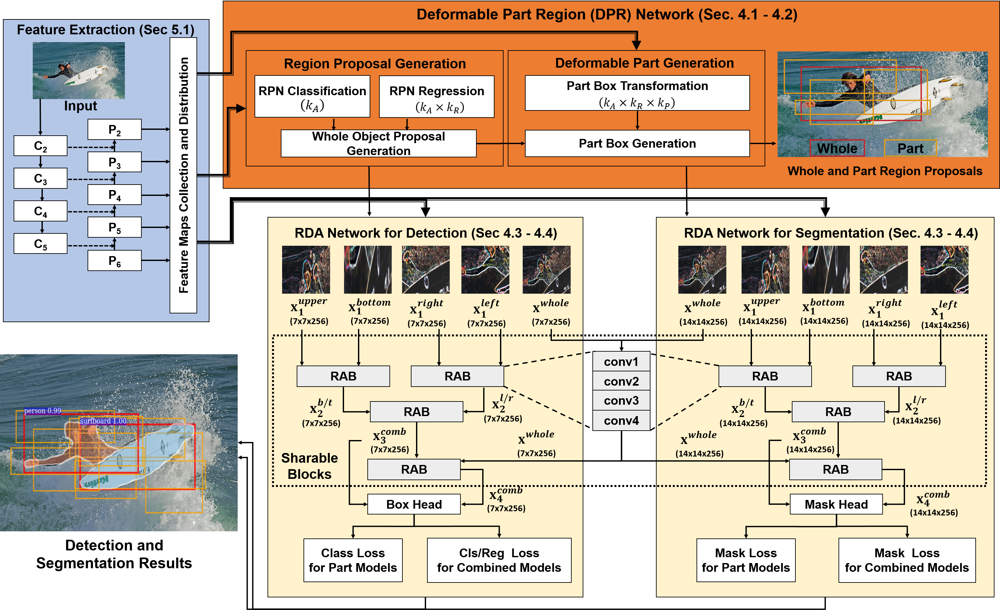

## [Deformable Part Region Learning for Improving Cascade Object Detection](https://arxiv.org)

<!-- [[ArXiv]](https://arxiv.org/abs/) -->

Cascade deformable part region detector (**Cascade D-PRD**) which can refine whole and part detections iteratively in the cascade manner.

* The code will be opened soon to the public.

## Abstract

In a convolutional object detector, the detection accuracy can be degraded often  due to the low feature discriminability  caused by geometric variation or transformation
of an object. In this paper, we propose a deformable part region learning in order to allow decomposed part regions to be deformable according to geometric transformation of an object. 
To this end, we introduce trainable geometric parameters for the location of each part model.
Because the ground truth of the part models is not available, we design classification and mask losses for part models, and learn the geometric parameters by minimizing an integral loss including those part losses. As a result, we 
can train a deformable part region network without extra super-vision, and make each part model deformable according to object scale variation. Furthermore, for improving
cascade object detection and instance segmentation, we present a Cascade deformable part region architecture which can refine whole and part detections iteratively in the cascade manner. 
Without bells and whistles, our implementation of a Cascade deformable part region detector achieves better detection and segmentation mAPs on COCO and VOC datasets, 
compared to the recent cascade and other state-of-the-art detectors. 

## Highlights

* **State-of-the-art performance without bells and whistles:** Cascade D-PRD achieves impressive performance outperforming Cascade R-CNN and HTC by large margins.
* **Easy modification:** Our DPR-Net can be applied easily for the existing anchor-based detectors with simple modification.

## COCO2019 test-dev results

|Method|Backbone|Lr sched|box AP|mask AP|Download|
|:--------:|:--------:|:---:|:----:|:----:|:----------------:|
Mask RCNN|ResNet101-FPN|3x|42.9|38.6|
**D-PRD**|ResNet50-FPN|3x|43.6|38.8|
**D-PRD**|ResNet101-FPN|3x|45.3|40.0|
||
**Cascade D-PRD**|ResNet50-FPN|3x|46.5|40.0|
**Cascade D-PRD**|ResNet101-FPN|3x|48.3|41.7|
**Cascade D-PRD**|ResNeXt101-FPN|3x|49.2|42.4|
||
**Cascade D-PRD (TTA)**|ResNet50-FPN|3x|48.5|42.5|
**Cascade D-PRD (TTA)**|ResNet101-FPN|3x|50.2|43.8|
**Cascade D-PRD (TTA)**|ResNeXt101-FPN|3x|51.1|44.7|>
* TTA denotes Test-Time Augmentation.

## Qualitative Results

